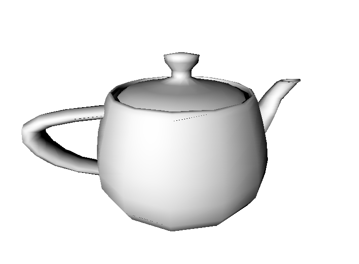
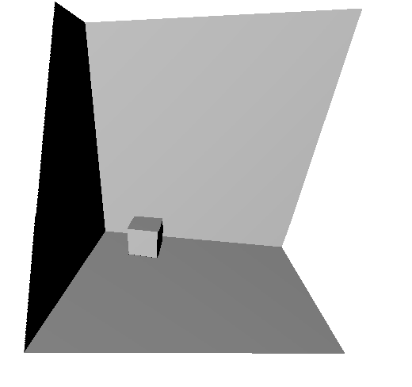

# Graphics-CL

This is a triangle rasterizer that is based on OpenCL parallel algorithms.

## Compilation and Installation

The library requires only CMake and OpenCL to compile, and the demo requires SDL2.

```
$ mkdir build
$ cmake ..
$ make
$ gcl/demo_draw_model ../models/teapot.obj # if there's any
```

> Only have tested on Linux x64 at present.

## Achievement

In the demo I implemented a program that can read a model from Wavefront OBJ format file, display them, and form rotation animation as below. Both scenes are built by Blender and exported as OBJ.



Meanwhile you are allowed to write your own shader (in OpenCL C Language syntax of course). In the demo I wrote a simple Lambertian shader.



In this scene there is a box placed on the floor and two planes as the wall placed around. Primitives outside the CVV box are well clipped is well clipped as you may have seen.

 Scene | Box | Teapot
-------|-----|--------
 Intel HD Graphics 4400 | 63 | 48
 NVIDIA GeForce 740M | 50 | 43

This table above is demo's FPS tested on my laptop, and on two different devices repectively. The NVIDIA driver is provided by bumblebee optirun.

